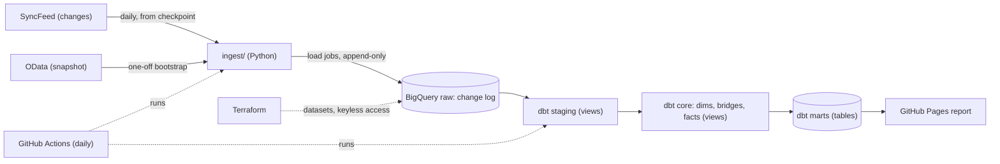
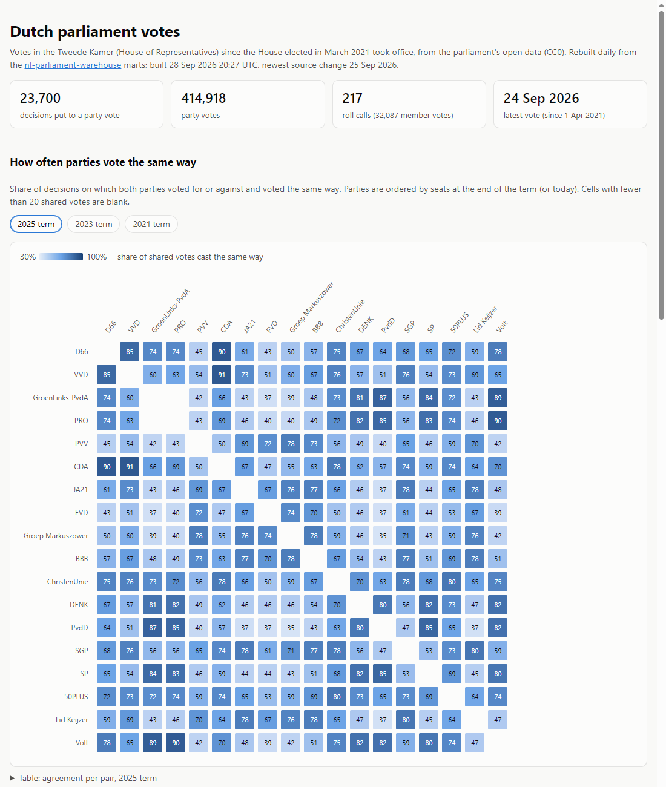
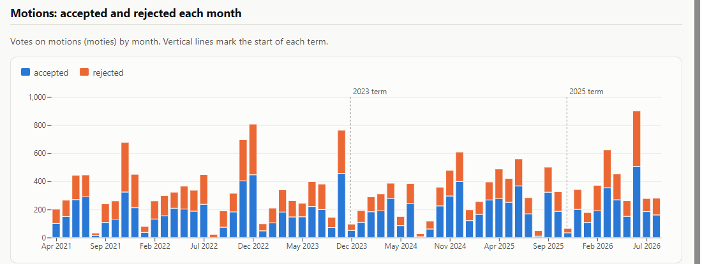

# nl-parliament-warehouse

[](https://github.com/kaeldrin-gh/nl-parliament-warehouse/actions/workflows/ci.yml)
[](https://github.com/kaeldrin-gh/nl-parliament-warehouse/actions/workflows/ingest.yml)
[](LICENSE)

**[Live report](https://kaeldrin-gh.github.io/nl-parliament-warehouse/)**: how parties vote, rebuilt daily · **[dbt docs](https://kaeldrin-gh.github.io/nl-parliament-warehouse/docs/)**: lineage, columns and tests

A warehouse of votes in the Dutch House of Representatives (Tweede Kamer). It
stays current from the parliament's own change feed, lands in BigQuery with no
billing account, and is modeled in dbt into party and member votes, decisions,
cases and party membership over time.

**Stack:** Python · BigQuery (sandbox) · dbt · DuckDB · Terraform · GitHub Actions

Companion projects on European power markets:
[de-energy-streaming](https://github.com/kaeldrin-gh/de-energy-streaming)
(streaming lakehouse),
[nl-energy-warehouse](https://github.com/kaeldrin-gh/nl-energy-warehouse)
(dbt analytics engineering) and
[databricks-energy-quality](https://github.com/kaeldrin-gh/databricks-energy-quality)
(managed lakehouse).

## Where to look first

| If you have | Read |
| --- | --- |
| 2 minutes | The architecture below and the [live report](https://kaeldrin-gh.github.io/nl-parliament-warehouse/) |
| 10 minutes | [ingest/loader.py](ingest/loader.py) (snapshot, change feed, checkpoints) with [tests/test_loader.py](tests/test_loader.py), and the version rule in [dbt/macros/latest_versions.sql](dbt/macros/latest_versions.sql) with its dbt unit test |
| A design discussion | [docs/design.md](docs/design.md): the source, the sandbox's tested limits, and the alternatives rejected |
| The data | [docs/data-quality.md](docs/data-quality.md): problems found in the source and how each is handled |

## Architecture



- **Change capture from a public source.** The Tweede Kamer SyncFeed republishes
  a whole entity on every change and a tombstone on deletion. The loader reads it
  from a stored checkpoint. A one-off OData snapshot bootstraps each entity from
  a feed position taken before the snapshot, so nothing between the two is lost.
- **Exactly-once in effect.** Rows are written before the checkpoint; a crash
  between the two re-reads the batch, and staging keeps one row per version.
  The version key is the source's own change time, because the two APIs'
  publication timestamps disagree by about a second.
- **Inside the BigQuery sandbox.** No `INSERT`, `UPDATE` or `MERGE`, tables that
  expire after 60 days, and 10 GiB of lifetime storage. The loader appends
  with load jobs, renews tables before they expire, and logs the size of every
  data load and every dbt table in a storage ledger, refusing to write past
  8 GiB. The whole raw layer is 314 MB.
- **A dimensional model with history.** Staging and core are views, so they
  store nothing. Every core model and mart has an enforced contract; 104 data
  tests and a unit test cover keys, relationships, House-size limits and the
  change-log rules.
- **Personal data stays at the source.** Each entity is an allowlist in
  [ingest/entities.py](ingest/entities.py); OData requests select only those
  columns, and tests fail if a private field appears.
- **Keyless CI.** [terraform/](terraform/) creates the datasets, a
  least-privilege service account and a Workload Identity Federation provider
  that only this repository can use; no service-account key exists.

## What the data says



From the marts on 28 September 2026, covering 1 April 2021 to 24 September 2026:

| Metric | Value |
| --- | --- |
| Decisions put to a party vote | 23,700 |
| Party votes | 414,918 |
| Roll calls (member votes) | 217 (32,087) |
| Motions accepted | 11,874 of 20,645 (57.5%) |
| Amendments accepted | 1,077 of 2,430 (44.3%) |
| Party votes cast for or against, not "not taking part" | 98.4% |



The [live report](https://kaeldrin-gh.github.io/nl-parliament-warehouse/) has
the agreement matrix for each term, participation by party and motions by
submitting party, with a table behind every chart. The numbers describe how
parties voted, not why.

## Quickstart

Everything runs locally on DuckDB from one real voting day committed as
fixtures; no cloud account is needed.

```bash
python -m venv .venv
source .venv/bin/activate          # Windows: .venv\Scripts\activate
pip install -e ".[test,dbt]"

python -m pytest -q                # loader, parser, allowlist, report
export DUCKDB_PATH=warehouse/sample.duckdb
python -m ingest.cli load-sample   # 6,502 raw rows from 2 June 2026
dbt build --project-dir dbt --profiles-dir dbt
python -m report.build --out site  # open site/index.html
```

To load the live source into DuckDB instead, run `python -m ingest.cli
bootstrap`, then `python -m ingest.cli changes` each day. BigQuery setup,
recovery steps and the storage ledger are in
[docs/operations.md](docs/operations.md).

## CI/CD

- **ci** (every push): ruff, pytest, `dbt build` on the DuckDB sample (models,
  contracts, data tests and the unit test), a report build, and Terraform
  format and validation.
- **ingest** (daily, 04:30 UTC): reads the change feed into BigQuery, renews
  tables near expiry, checks the storage budget, runs `dbt build` on all data,
  logs the marts' size, and publishes the report and dbt docs to GitHub Pages.
  A failed run opens one GitHub issue (deduplicated while it is open).

## Layout

```
ingest/          feed parser, OData and feed client, loader, sinks, CLI
dbt/             staging, core and mart models, macros, tests
report/          the static report and its charts
terraform/       datasets, service account, Workload Identity Federation
scripts/         the one-day sample extractor
tests/           Python tests and real-data fixtures
docs/            design, operations runbook, data-quality findings
```

## License

MIT, see [LICENSE](LICENSE). Data from the Tweede Kamer der Staten-Generaal,
published under [CC0 1.0](https://opendata.tweedekamer.nl/disclaimer).
