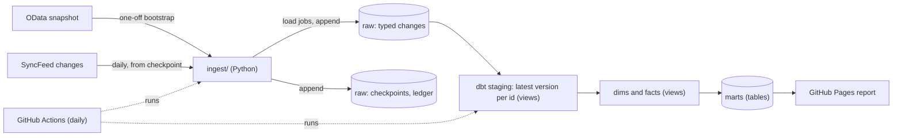

# Design: nl-parliament-warehouse

Status: 28 September 2026. Milestones M0 (repository setup), M1 (the loader
and its infrastructure) and M2 (the dbt model) are done; M3 onward is planned.

## Objective

Build a warehouse of Dutch House of Representatives (Tweede Kamer) votes and
decisions that stays current from the parliament's own change feed, runs on a
real cloud warehouse without a billing account, and answers descriptive
questions such as how often two parties vote the same way.

The project exists to show work the author's energy repositories cannot:

- Change data capture from a source that updates and deletes records.
- A dimensional model with several facts, history-keeping dimensions and
  many-to-many relationships.
- A cloud warehouse (BigQuery) under hard quota limits.
- Governance: an explicit personal-data policy that tests enforce.

### Non-goals

- Judging parties or members. Every output is a count or a rate with its
  definition next to it.
- Full parliamentary history. The scope starts on 31 March 2021, when the
  House elected that month took office.
- Real-time updates. The source changes a few times a day; a daily run is
  enough.

## Background

### The source

The Tweede Kamer publishes its data warehouse (Gegevensmagazijn) through two
APIs, both without a key and under
[CC0 1.0](https://opendata.tweedekamer.nl/disclaimer):

- **OData v4** (`/OData/v4/2.0/<Entity>`): queryable JSON, 250 rows per page,
  `$filter`, `$count`, and a `Verwijderd` (deleted) flag on every entity.
- **SyncFeed** (`/SyncFeed/2.0/Feed?category=<Entity>`): an Atom feed of
  changes, 250 per page.

Tests on 28 September 2026 established the SyncFeed behavior this design
relies on:

- Each entry holds the whole entity as it is after the change.
- A deletion is a tombstone: `<stemming id="…" tk:verwijderd="true" />` with no
  other fields.
- Each entry's `next` link carries a `skiptoken` that resumes the feed directly
  after it. The token is one global sequence across all entities (about
  26.7 million in September 2026), so it is a checkpoint.
- The feed reaches the present: the newest page read held changes from
  25 September 2026.
- Document entries link to their PDF.

The API throttles bandwidth per IP address, so the loader requests pages one
at a time and backs off on errors.

Rows changed since 31 March 2021, from `$count`:

| Entity | Meaning | Rows |
| --- | --- | ---: |
| `Stemming` | one party's (or member's) vote on one decision | 454,488 |
| `Besluit` | a decision on an agenda item | 288,078 |
| `Agendapunt` | an agenda item | 125,388 |
| `Zaak` | a case: motion, bill, amendment | 93,837 |
| `Activiteit` | a sitting or meeting, with its date | 22,825 |
| `ZaakActor` | who submitted or co-signed a case | 917,325 (all years) |
| `FractieZetelPersoon` | a member's seat in a party, from `Van` to `TotEnMet` | 1,236 (all years) |
| `Persoon`, `Fractie` | members, parties | 4,477, 160 (all years) |

### The warehouse: BigQuery sandbox

A BigQuery project without a billing account runs in sandbox mode. Tested on
28 September 2026 in project `project-510017`, location `EU`:

| Capability | Result |
| --- | --- |
| Load jobs (append or truncate) | works |
| `CREATE TABLE … AS SELECT`, views, window functions, `QUALIFY` | works |
| `INSERT`, `UPDATE`, `MERGE` | refused: "DML queries are not allowed in the free tier" |
| Table and partition expiry | 60 days after creation; removing it is refused |
| Re-creating a table with `CREATE OR REPLACE TABLE … AS SELECT` | resets the expiry to 60 days from now |
| Re-running a load with `WRITE_TRUNCATE` into one partition | replaces the partition, no duplicates |
| GitHub Actions through Workload Identity Federation | works, with no key file |

Two limits shape the design:

1. **No DML.** dbt snapshots and incremental `merge` models do not work.
2. **Storage quota.** Google documents "a lifetime limit of 10 GiB of storage.
   This quota is not refunded upon data deletion." This design assumes the
   strict reading: every byte ever written counts.

## Design



### Ingestion

The loader has two modes. They follow the usual CDC bootstrap: record the log
position first, take the snapshot, then replay the log from that position.

1. **Bootstrap (once).** Find the feed head: the smallest `skiptoken` with no
   change after it, by bisection on the unfiltered feed (about 50 requests,
   10 seconds). Then page through OData for each entity inside the scope and
   store the head as the entity's first checkpoint. Changes that happen during
   the snapshot are read again by the feed; the staging layer removes the
   overlap. OData requests use `$select`, so only allowlisted columns ever
   leave the source.
2. **Daily change run.** For each entity, read the SyncFeed from its latest
   checkpoint until a page holds fewer than 250 changes, in batches of 20 pages
   (5,000 changes).

Each batch is written in this order:

1. Load the batch into `raw.<entity>_changes` with an append load job.
2. Append one row to `raw.checkpoints` with the batch's last `resume_token`.

A crash between the two steps makes the next run read the batch again. The
duplicate rows have the same `(id, source_updated)` and staging drops them,
so the pipeline is at-least-once on write and exactly-once in effect.

The version key is `source_updated`, the source's own change time
(`GewijzigdOp` in OData, `tk:bijgewerkt` in the feed). The API timestamps
cannot order versions across the two APIs: for the same change, the feed's
Atom `updated` and OData's `ApiGewijzigdOp` differ by about a second. The feed
gives `tk:bijgewerkt` in Amsterdam local time without an offset; the loader
converts it to UTC, after which it equals OData's `GewijzigdOp`. When a
snapshot row and a feed row have the same version, the feed row wins, because
it carries a `resume_token`. A test on live data found feed and OData rows
equal, field for field, for every entity.

Raw tables are **typed and allowlisted**, not JSON blobs. Every row carries
`id`, `deleted`, `api_updated`, `source_updated`, `resume_token` (null for
snapshot rows), `batch_id`, `loaded_at`, and the entity's allowlisted columns.
This keeps writes small for the storage quota and keeps personal data out from
the first byte (see [Governance](#governance)).

The checkpoint and the storage ledger are append-only tables, because the
sandbox cannot update rows. The current checkpoint is the newest row.

### Staying inside the sandbox

| Limit | Response |
| --- | --- |
| No DML | Raw is append-only. History and "current version" are computed with window functions over the change log, not with dbt snapshots or `MERGE`. |
| 60-day expiry | A renewal step re-creates any raw table older than 45 days with `CREATE OR REPLACE TABLE t AS SELECT * FROM t`. Marts are rebuilt every run, so they never age. |
| 10 GiB lifetime storage | Staging and core models are views, which store nothing. Only marts (M3) will be tables, and each is small. Raw is lean: the bootstrap wrote 314 MB for 1.2 million rows (3% of the quota). |
| 1 TiB of queries a month | A full `dbt build` on BigQuery (the models plus 110 tests) scans 4.3 GB in 161 queries; run daily, that is about 130 GB a month. |
| Quota visibility | Every job's written bytes are appended to `raw.storage_ledger`. Before writing, the loader sums the ledger and refuses to write above 8 GiB, leaving room for a controlled wind-down. |

If the pipeline stops for more than 60 days, raw expires. The source is the
system of record, so the recovery path is a fresh bootstrap; it was tested on
BigQuery by removing a table (see [operations.md](operations.md)). A quiet run
still appends an `idle` checkpoint row, so `dbt source freshness` can tell a
quiet day from a stopped pipeline.

### Transformation

dbt with the BigQuery adapter. CI builds the same project on DuckDB from one
real voting day committed as fixtures (`scripts/make_sample.py`, 6,502 raw
rows), so pull requests are tested without cloud credentials; the daily run
builds and tests on BigQuery with the full data. The few differences between
the two SQL dialects live in `dbt/macros/cross_db.sql`, and contracts use the
type names both engines share (`string`, `int64`, `bool`, `date`).

Staging views rename the Dutch fields to English and keep the newest version
of each entity, without deleted ones (`dbt/macros/latest_versions.sql`):

```sql
select *
from (
    select *, row_number() over (
        partition by id
        order by source_updated desc, resume_token desc nulls last, loaded_at desc
    ) as version_rank
    from {{ source('raw', 'stemming_changes') }}
) as versions
where version_rank = 1 and not deleted
```

A dbt unit test feeds this rule an update, a deletion, a snapshot/feed tie
and a replayed batch.

### Dimensional model

| Model | Grain | Notes |
| --- | --- | --- |
| `dim_member` | one member | Public-role columns only. Names fall back to the votes and cases when the source's person record is empty ([data-quality.md](data-quality.md), DQ-2). |
| `dim_party` | one party record | Name, abbreviation, active dates. |
| `dim_term` | one parliamentary term | Election and installation dates; the installations match the seat data. |
| `dim_date` | one date | Calendar, ISO week, term. |
| `dim_case` | one case (motion, bill, amendment) | Type, title, status. |
| `dim_decision` | one decision | Joined to agenda item and sitting for the decision date. |
| `bridge_party_membership` | one member in one party for one interval | From `FractieZetelPersoon` `Van` / `TotEnMet`. |
| `bridge_case_submitter` | one member or party submitting or co-signing one case | From `ZaakActor` with a submitter relation. |
| `fct_party_vote` | one party's vote on one decision | For, against, or not taking part; party seats at the time; the mistake flag (`Vergissing`). |
| `bridge_decision_case` | one decision and one case | From the decision's case links. |
| `fct_member_vote` | one member's vote on one roll-call decision | Only when individual votes were recorded (`Persoon_Id` set). `seat_party_id` is the party whose seat the member held that day ([data-quality.md](data-quality.md), DQ-1). |

Membership has two timelines, and the model keeps both:

- **Valid time:** when a member actually sat in a party, from the source's
  `Van` and `TotEnMet`.
- **Record time:** when the source recorded the change, from `source_updated`
  in the change log.

Keeping both answers "which party was this member in on the day of the vote"
and "what did the warehouse believe on a given date".

### Marts

Each mart states its definition in the model's YAML and on the report page:

- `mart_party_agreement`: for each pair of parties and month, the share of
  decisions where both took part and voted the same way.
- `mart_case_outcomes`: accepted and rejected motions and amendments by type,
  month and submitting party.
- `mart_vote_participation`: the share of decisions each party took part in.

## Governance

- **Personal data allowlist.** `Persoon` keeps only `Id`, `Nummer`,
  `Initialen`, `Roepnaam`, `Tussenvoegsel`, `Achternaam`, `Functie` and
  `Fractielabel`. Birth, death, residence and gender fields are never loaded,
  and neither are the related entities for gifts, travel, side jobs and contact
  details (`PersoonGeschenk`, `PersoonReis`, `PersoonNevenfunctie`,
  `PersoonContactinformatie`). A unit test fails if a landing schema contains a
  column outside its allowlist.
- **Contracts and tests.** Every core model is contract-enforced; 110 checks
  cover keys, relationships, accepted values, House-size limits (at most
  150 seats behind a decision's votes) and the change-log rules. Source
  problems that the data really has warn instead of failing, and each is
  written up in [data-quality.md](data-quality.md).
- **Lineage and docs.** dbt docs with column descriptions, published to GitHub
  Pages.
- **Access.** GitHub Actions authenticates through Workload Identity
  Federation, restricted to this repository; no service-account key exists.
  The service account holds `bigquery.jobUser` on the project and write access
  to this project's datasets only.

## Orchestration

A daily GitHub Actions workflow runs ingest, renewal, `dbt build`, and the
report. The job is a short sequential chain, so a scheduler service would add
cost without adding capability; Airflow is shown in de-energy-streaming. A
failed run opens one GitHub issue, deduplicated while it is open, the same as
in the other repositories.

## Testing

- **Parser tests** against real feed pages (CC0) committed as fixtures.
- **Replay tests:** loading the same batch twice produces the same staging
  output.
- **Bootstrap overlap test:** a snapshot row and a later feed row for the same
  id resolve to the feed row.
- **dbt tests and a dbt unit test** on DuckDB in CI (one real day) and on
  BigQuery in the daily run (all data).
- **Allowlist test** for personal data.

## Milestones

| Milestone | Scope |
| --- | --- |
| M0 | Repository, CI, the feed parser and its tests, this document. Done. |
| M1 | Loader: bootstrap, daily change run, checkpoints, storage ledger, renewal, recovery test. Terraform for the datasets and the identity provider. Done. |
| M2 | dbt staging, dimensions, facts, contracts and tests on DuckDB and BigQuery. Done. |
| M3 | Marts, the GitHub Pages report, README, and making the repository public. |
| M4 (optional) | Documents: text extraction, local embeddings, similar-motion search with a retrieval test set. |
| M5 (optional) | Bundestag DIP API as a German counterpart. |

## Alternatives considered

- **DuckDB as the engine and BigQuery for serving only.** Safer for the
  storage quota, but it would repeat nl-energy-warehouse and reduce BigQuery
  to a display layer. Rejected; the ledger and the lean raw layer handle the
  quota instead.
- **Raw JSON payloads in BigQuery.** Simplest to write, but about three times
  the storage and it would load personal data before filtering it. Rejected.
- **dbt snapshots for history.** They need `MERGE`. The change log already
  holds every version, so window functions over it give the same history.
- **Snapshot-only loading from OData every day.** About 4,000 requests for
  votes alone each run, and deletions would have to be inferred from missing
  rows. Rejected in favor of the feed.

## Risks and open questions

- **Storage quota wording.** If the quota counts only data at rest, the ledger
  is merely conservative. If it counts every write, the ledger is what keeps
  the project alive. The design works under both readings.
- **Scope filter in OData (resolved).** Nested filters work
  (`Besluit/Agendapunt/Activiteit/Datum ge …`), and so do `any()` filters. Cases
  use `GestartOp ge … or Besluit/any(…)`, which keeps the 5,228 cases opened
  before the scope start but decided inside it. The feed cannot be filtered by
  date, so it also brings changes to out-of-scope entities; staging filters
  those out.
- **Roll-call coverage.** Individual votes exist only for roll-call decisions,
  so `fct_member_vote` is sparse by nature and the report says so.
- **Party splits and renames.** Handled through `dim_party` active dates; the
  agreement mart compares parties as they existed at the time of each vote.
- **Neutrality.** The report shows definitions next to every number and makes
  no rankings.
